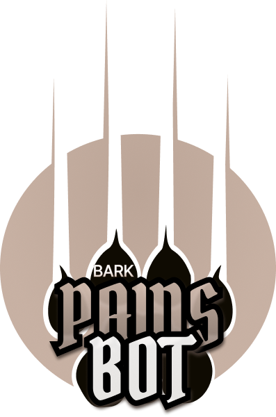

# BarkPaws Monorepo

Welcome to the BarkPaws Monorepo! This repository contains various projects and components related to the BarkPaws ecosystem, including the BarkPaws Telegram Bot, BarkPaws dApp, smart contracts, and more.

## Projects

### 1. BarkPaws Telegram Bot

The BarkPaws Telegram Bot provides a user-friendly interface for interacting with various functionalities related to decentralized finance (DeFi) on the Solana blockchain. Users can perform token swaps, monitor trades, access support, and participate in humanitarian aid initiatives directly from their Telegram app.

[View Telegram Bot Documentation](./telegram-bot/README.md)

### 2. BarkPaws dApp

The BarkPaws dApp is a decentralized application built using Next.js and React, providing an intuitive interface for users to interact with the BarkPaws ecosystem. Users can swap tokens, monitor trades, participate in fundraising campaigns, and more, all within a seamless web interface.

[View dApp Documentation](./dapp/README.md)

### 3. BarkPaws Smart Contracts

Smart contracts play a crucial role in the BarkPaws ecosystem by facilitating token swaps, fundraising campaigns, and governance mechanisms. This directory contains the Solidity smart contracts deployed on the Solana blockchain, ensuring transparency, security, and efficiency in various operations.

[View Smart Contracts / Programs Documentation](./smart-contracts/README.md)

## Key Features and Improvements:

- **Enhanced User Experience**: Continuously improving user interfaces and interactions to ensure seamless navigation and engagement.
- **Optimized Performance**: Regular optimizations and updates to enhance performance, responsiveness, and reliability across all projects.
- **Advanced Security Measures**: Implementing robust security measures, including code audits, vulnerability assessments, and bug fixes to safeguard user assets and data.
- **Community Feedback Integration**: Actively soliciting and integrating feedback from the BarkPaws community to prioritize features, address issues, and enhance overall user satisfaction.
- **Scalability and Interoperability**: Designing projects with scalability and interoperability in mind to accommodate future growth and integration with external platforms and protocols.
- **Documentation and Support**: Improving documentation and support resources to empower developers and users with comprehensive guides, tutorials, and troubleshooting assistance.

## Getting Started

To get started with any project within the BarkPaws Monorepo, follow the specific instructions provided in each project's README.md file. Ensure you have the necessary dependencies installed and configured before proceeding.

## Contributions

Contributions to the BARK Protocol ecosystem are welcome! Whether you're interested in improving the Telegram bot, enhancing the dApp, optimizing smart contracts, or exploring new features, we encourage you to fork the repository, make your improvements, and create a pull request. Our team will review your contributions promptly.

For detailed contribution guidelines, refer to each project's respective README.md file.

## Support and Feedback

If you have any questions, feedback, or need assistance with any aspect of the BarkPaws ecosystem, feel free to reach out to us. You can contact us through our official channels or open an issue in the respective project's repository.

We appreciate your interest in BarkPaws or BARK Protocol and look forward to building a thriving community together!

Happy coding!
